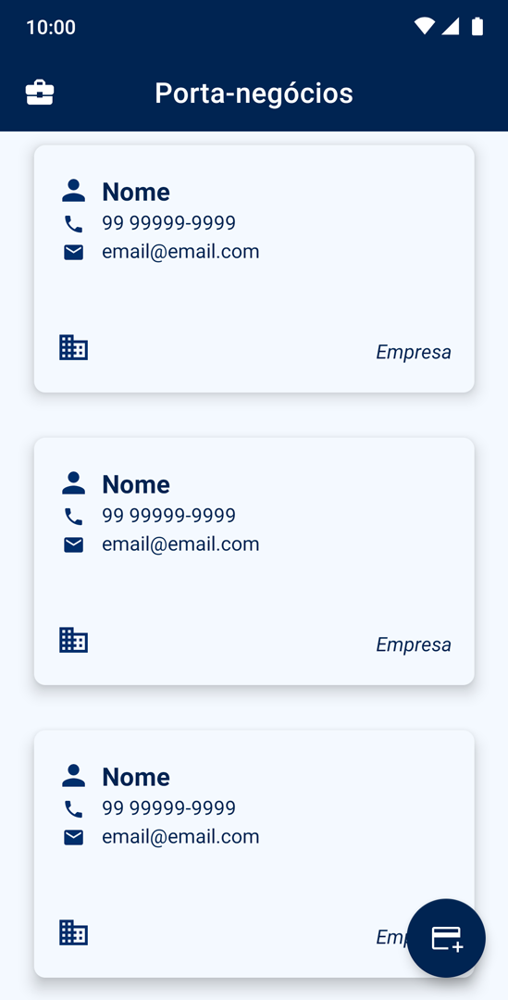
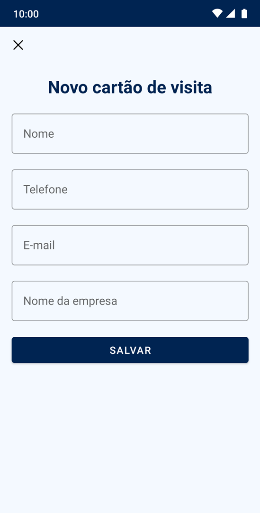

# Porta-negócios  
(*Obs.: esse aplicativo foi desenvolvido como um desafio de projeto da [DIO](https://www.dio.me/) para o bootcamp "Santander Mobile Developer".*)  

O nome do app surge de sua praticidade em permitir armazenar no celular, um aparelho *portátil*, os contatos dos mais diversos *negócios* e profissionais.

## **Funcionalidades**
O aplicativo permite adicionar, salvar e compartilhar cartões de visita.  
As ações de salvar e de compartilhar se dão ao tocar em cima do cartão de visita desejado.

## **Implementações e ferramentas utilizadas** 
- [Activity](https://developer.android.com/jetpack/androidx/releases/activity), 
[Lifecycle](https://developer.android.com/topic/libraries/architecture/lifecycle),
[RecyclerView](https://developer.android.com/guide/topics/ui/layout/recyclerview), 
[Room](https://developer.android.com/training/data-storage/room)
e [ViewBinding](https://developer.android.com/topic/libraries/view-binding).

## **Design da interface**
- **Cores**:
   - Foi utilizada a cor azul, que é considerada a cor da Administração, da confiança e dos negócios.
   
- **Ícones**:
  - Para representar o app, foi escolhida uma mala, objeto que pode ser simultaneamente associado à ideia de portabilidade e de viagem, 
  bem como também à ideia de negócios e de empresas (empresários e suas maletas, por exemplo).
  
### Capturas de tela

  
   

